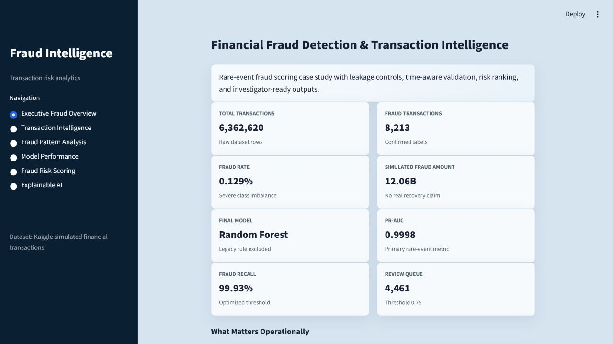
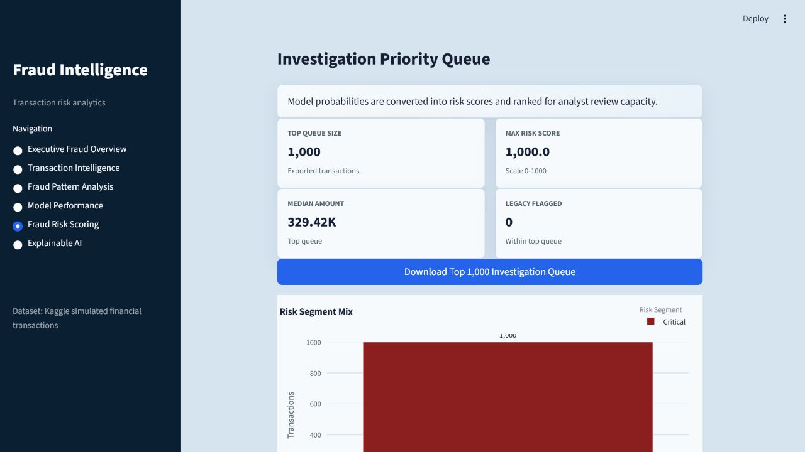
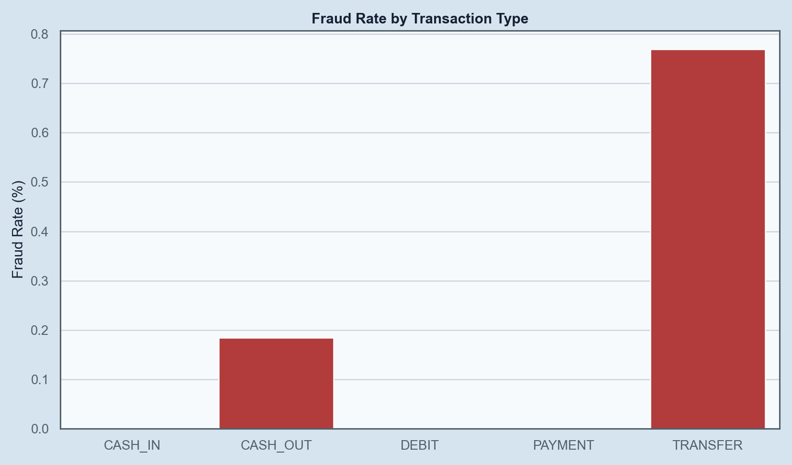
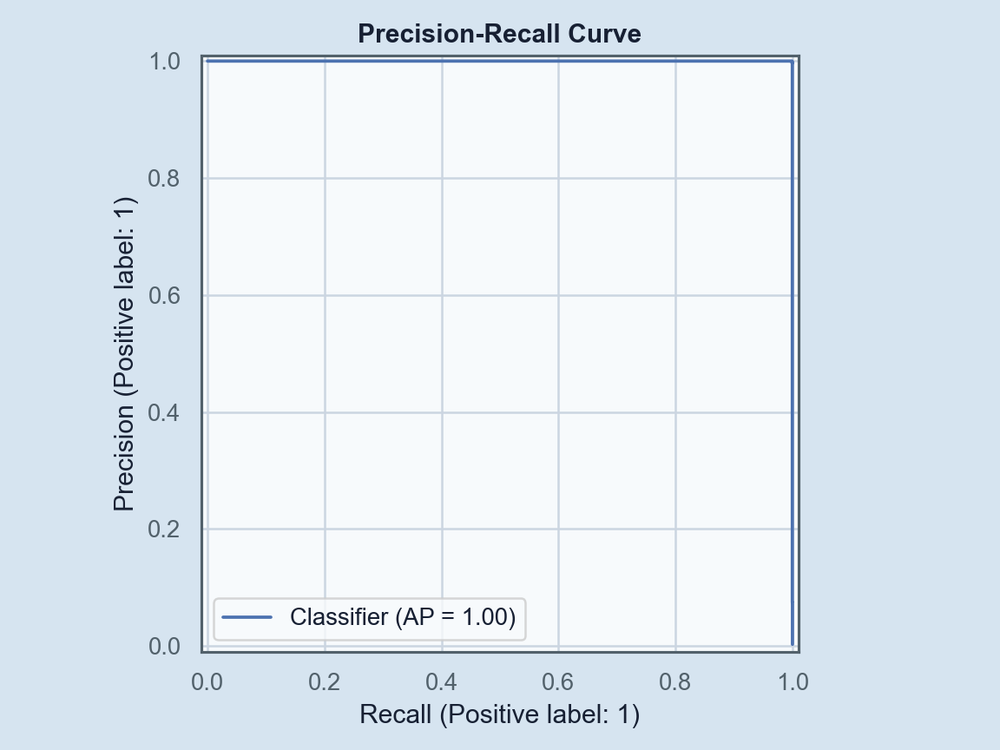
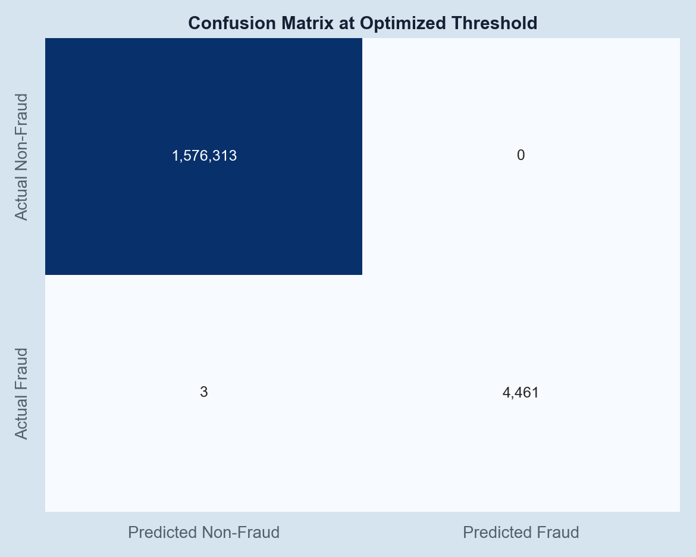
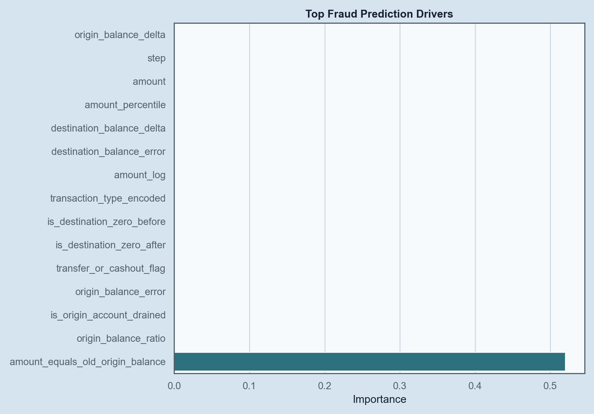

# Financial Fraud Detection & Transaction Intelligence

Enterprise-grade Data Science portfolio project for fraud-risk scoring, transaction intelligence, model evaluation, and investigation prioritization.

## Executive Summary

Financial institutions process millions of transactions while confirmed fraud is extremely rare. This project builds a leakage-aware machine learning workflow that assigns fraud probability, converts probability into operational risk scores, ranks transactions for investigation, and explains the main drivers behind model decisions.

The project is built as a professional financial crime analytics case study, not a one-off notebook. It includes reproducible Python modules, time-aware validation, SQL reporting, model artifacts, risk-score exports, and a Streamlit dashboard using the approved light background color `#D6E4F0`.

## Dataset

- Source: [Kaggle Fraud Detection Dataset](https://www.kaggle.com/datasets/amanalisiddiqui/fraud-detection-dataset)
- Local raw file: `data/raw/AIML Dataset.csv`
- Rows: 6,362,620
- Columns: 11
- Target: `isFraud`
- Fraud transactions: 8,213
- Fraud rate: 0.1291%
- Missing values: 0
- Duplicate rows: 0

### Dataset Limitations

This is simulated financial transaction data. It does not contain real customer demographics, real timestamps, investigation outcomes, recovery amounts, operational costs, customer lifetime value, churn, or actual bank revenue impact. Any business value analysis should be treated as a scenario simulation, not a real ROI claim.

## Business Problem

Rule-based fraud systems can miss suspicious transaction behavior and overwhelm investigation teams with false positives. The goal is to prioritize the transactions most likely to be fraudulent while keeping the review queue operationally manageable.

## Business Solution

The solution combines:

- Data quality and leakage audit
- Fraud-focused feature engineering
- Class-imbalance-aware model training
- Time-aware validation using `step`
- PR-AUC, recall, precision, F2, top-K capture, and threshold optimization
- Risk-score generation for investigation queues
- SQL reporting for transaction intelligence
- Explainability using permutation importance, with optional SHAP extension
- Streamlit dashboard for executive and analyst workflows

## Key Findings

- Fraud appears only in `TRANSFER` and `CASH_OUT` transactions.
- `isFlaggedFraud` triggers only 16 times and captures 0.1948% of all fraud cases.
- Balance-drain and amount-equals-origin-balance behavior are strong fraud signals in this simulated dataset.
- Account identifiers are high-cardinality IDs and are not treated as normal categorical features.

## Model Results

Final model: Random Forest  
Feature set: excludes `isFlaggedFraud`  
Validation strategy: time-aware split using row-quantile `step` cutoff  
Step cutoff: 335

| Metric | Value |
|---|---:|
| Validation rows | 1,580,777 |
| Validation fraud rows | 4,464 |
| PR-AUC | 0.9998 |
| ROC-AUC | 0.999992 |
| Optimized threshold | 0.75 |
| Fraud precision | 100.00% |
| Fraud recall | 99.93% |
| F2 score | 99.95% |
| False positives | 0 |
| False negatives | 3 |

The high validation performance is plausible for this simulated dataset because the fraud label is strongly associated with balance-drain patterns. This should not be interpreted as guaranteed real-world production performance.

## Top-K Investigation Capture

| Review Capacity | Reviewed Transactions | Fraud Captured | Precision | Recall |
|---|---:|---:|---:|---:|
| Top 0.1% | 1,581 | 1,581 | 100.00% | 35.42% |
| Top 0.5% | 7,904 | 4,463 | 56.47% | 99.98% |
| Top 1.0% | 15,808 | 4,463 | 28.23% | 99.98% |
| Top 5.0% | 79,039 | 4,464 | 5.65% | 100.00% |

## Feature Engineering

The project creates transaction behavior features such as:

- `amount_log`
- `amount_percentile`
- `origin_balance_delta`
- `destination_balance_delta`
- `origin_balance_error`
- `destination_balance_error`
- `is_origin_account_drained`
- `amount_equals_old_origin_balance`
- `origin_balance_ratio`
- `destination_balance_ratio`
- `transfer_or_cashout_flag`
- `customer_to_customer_flag`
- `customer_to_merchant_flag`
- `step_hour_bucket`
- `step_day_simulation`
- `risk_rule_score` as a business-facing rule signal, excluded from final ML features
- transaction-type dummy variables

## Leakage Prevention

- `isFraud` is never used as a feature.
- `isFlaggedFraud` is excluded from the final model and used only as a benchmark.
- `risk_rule_score` is retained for business segmentation but excluded from the final ML feature list so explanations show primitive transaction drivers.
- `nameOrig` and `nameDest` are not used as high-cardinality categorical features.
- Feature parameters are fit on the training sample and reused for validation/scoring.
- Validation is chronological using `step`, not a random split.

## Project Structure

```text
financial_fraud_detection_&_transaction_intelligence/
  data/
    raw/
      AIML Dataset.csv
    processed/
  notebooks/
    01_data_quality_and_leakage_audit.ipynb
    02_eda_transaction_intelligence.ipynb
    03_feature_engineering.ipynb
    04_model_training_and_evaluation.ipynb
    05_model_interpretability_and_business_recommendations.ipynb
  src/
    data/
    features/
    models/
    evaluation/
    interpretation/
    scoring/
    visualization/
    pipeline/
  sql/
  streamlit_app/
  models/
  outputs/
    charts/
    reports/
    predictions/
    risk_scores/
  tests/
```

## Dashboard

Live dashboard: [financial-fraud-detection-transaction-intelligence-b2x9b7uxjgl.streamlit.app](https://financial-fraud-detection-transaction-intelligence-b2x9b7uxjgl.streamlit.app/)

The Streamlit dashboard includes:

- Executive Fraud Overview
- Transaction Intelligence
- Fraud Pattern Analysis
- Model Performance
- Fraud Risk Scoring
- Explainable AI

Open the dashboard with:

```powershell
streamlit run streamlit_app/app.py
```

Design palette:

- Main light background: `#D6E4F0`
- Card background: `#F7FAFC`
- Primary text: `#172033`
- Primary navy: `#0B1F33`
- Accent blue: `#2563EB`
- Fraud risk red: `#C62828`

## Visual Evidence













## How to Run

```powershell
cd "D:\Project\Data Science\financial_fraud_detection_&_transaction_intelligence"
python -m venv .venv
.\.venv\Scripts\activate
pip install -r requirements.txt
python run_pipeline.py --max-train-nonfraud 120000
streamlit run streamlit_app/app.py
```

If the pipeline outputs already exist, the dashboard can be opened directly with:

```powershell
streamlit run streamlit_app/app.py
```

Python version used for this project: `3.13.1`.

Run tests:

```powershell
pytest
```

Optional advanced packages:

```powershell
pip install -r requirements-optional.txt
```

## Main Outputs

- `outputs/reports/data_quality_summary.md`
- `outputs/reports/model_performance_summary.md`
- `outputs/reports/model_comparison.csv`
- `outputs/reports/threshold_optimization_top50.csv`
- `outputs/reports/top_k_fraud_capture.csv`
- `outputs/reports/permutation_importance.csv`
- `outputs/risk_scores/investigation_priority_top_1000.csv`
- `models/fraud_detection_model.joblib`

## Business Recommendations

- Prioritize high-risk `TRANSFER` and `CASH_OUT` transactions.
- Do not rely only on `isFlaggedFraud`; it captures very few fraud cases.
- Use model probability to rank investigation queues by capacity.
- Tune thresholds based on staffing capacity and tolerance for false positives.
- Monitor origin-account-drained and amount-equals-origin-balance behavior.
- Use explainability outputs to support investigator trust.
- Recalibrate the model before any production deployment.

## Portfolio Value

This project demonstrates end-to-end Data Scientist capability across data quality, feature engineering, fraud analytics, imbalanced classification, model evaluation, explainability, SQL reporting, dashboard design, and business communication.
